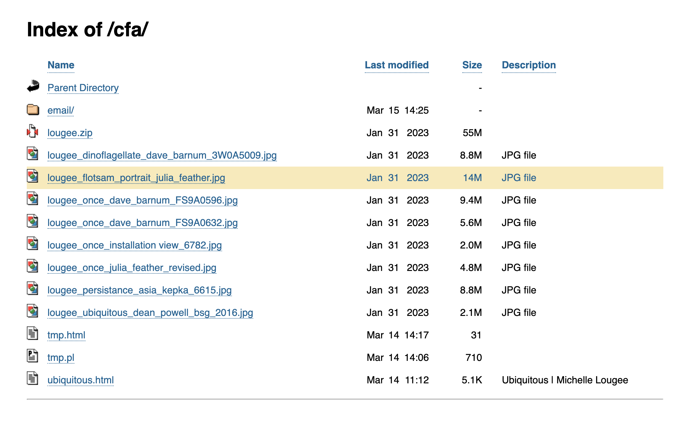

# dirlisting

Styles and formatting for directory listing pages using the Apache HTTPD web server's mod_autoindex module.

## Description

I've been working with Apache for over 20 years and never knew you could customize the directory listings! This is a great feature on development servers or when the purpose of the directory is to server simple files.

## Features



- Page is served as HTML5 and UTF-8 with mobile viewport defined and with a more descriptive title.

- Widened page, increased white space between rows and between columns, and switched to sans-serif font for enhanced readability.

- Defined hover state for each row and made the entire row clickable as a link, making it easier to navigate.

- Re-formatted the Last modified dates to match standard Linux directory listings: display time if file is less than six months old, otherwise display the year.

- Added an ascending or descending caret on the header of the sorted column.

- Included more descriptions (making sorting by file type possible)

### Installation

Installation depends on where you wish to house the `dirlisting` folder. This example configuration uses `/var/www/scripts`.

Add the following to your Apache configuration:

```apache
<IfModule mod_autoindex.c>
IndexOptions \
    SuppressHTMLPreamble \
    FancyIndexing \
    FoldersFirst \
    NameWidth=* \
    DescriptionWidth=* \
    Charset=UTF-8 \
    ScanHTMLTitles \
    UseOldDateFormat \
    HTMLTable

HeaderName /scripts/dirlisting/dirheader.html
ReadmeName /scripts/dirlisting/dirfooter.html

AddDescription "CSV spreadsheet" *.csv
AddDescription "MS Word" *.doc
AddDescription "GIF image" *.gif
AddDescription "JPEG image" *.jpg
AddDescription "Javascript" *.js
AddDescription "JSON document" *.json
AddDescription "PDF document" *.pdf
AddDescription "Perl script" *.pl
AddDescription "Python script" *.py
AddDescription "PNG image" *.png
AddDescription "SVG image" *.svg
AddDescription "Text document" *.txt
AddDescription "MS Excel" *.xls*
AddDescription "ZIP archive" *.zip

# IGNORE THESE FILES
IndexIgnore .DS_Store
</IfModule>
```

Note that if you have multiple websites, this configuration can go in the global `httpd.conf` file, but the `HeaderName` and `ReadmeName` directives need to be in your https or virtualhost configuration.

## Resources

The Apache mod_autoindex documentation is a terrific resource if you want to customize this further.

<https://httpd.apache.org/docs/2.4/mod/mod_autoindex.html>

## Authors

[Keith Carangelo](https://www.kcaran.com/)

## License

[MIT](https://choosealicense.com/licenses/mit/)
